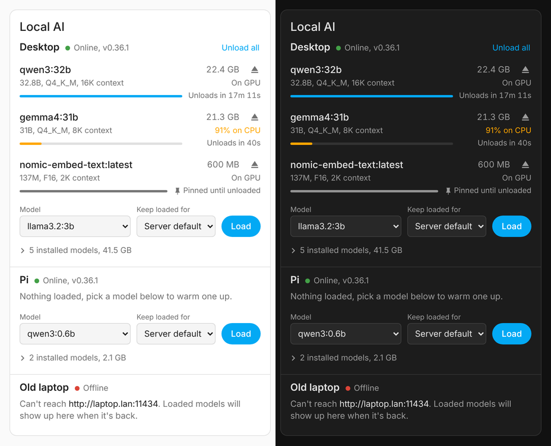

# Ollama Monitor for Home Assistant

See what every Ollama box in the house has loaded, how much VRAM it's eating and when it'll let go. Load and unload models from a dashboard card or an automation.



One integration entry per Ollama host (desktop, Pi, whatever). It polls the Ollama HTTP API, so nothing needs installing on the hosts themselves. A dashboard card ships inside the integration and is registered automatically.

## Install

**HACS:** HACS → ⋮ → Custom repositories → add this repo's URL as an *Integration* → download **Ollama Monitor** → restart Home Assistant.

**Manually:** copy `custom_components/ollama_monitor` into your config's `custom_components/` folder and restart.

Then **Settings → Devices & services → Add integration → Ollama Monitor**, once per host:

| Field | Notes |
| --- | --- |
| URL | `desktop.local` is fine: no scheme means `http://` and port `11434`. Full URLs work too, including reverse-proxied `https://ollama.example.com`. |
| Name | What the device is called (`Desktop`, `Pi`). Defaults to something derived from the hostname. |
| API key | Only if a proxy in front of Ollama wants a Bearer token. |

Ollama only listens on localhost by default. On each host set `OLLAMA_HOST=0.0.0.0` (for systemd: `systemctl edit ollama`, add `Environment="OLLAMA_HOST=0.0.0.0"`, restart) so Home Assistant can reach it.

The polling interval (default 10 s) is under the integration's **Configure** button.

## What you get per host

| Entity | What it is |
| --- | --- |
| `binary_sensor.<host>_online` | Connectivity. Stays available when the host is down so it can read *off*. |
| `binary_sensor.<host>_model_loaded` | On while anything is in memory. |
| `sensor.<host>_loaded_model` | The most recently used model, or `idle`. Attribute `models` lists everything loaded with size, VRAM, CPU/GPU split, context length and unload time. |
| `sensor.<host>_loaded_models` | How many are loaded. |
| `sensor.<host>_vram_used` | VRAM held by loaded models. |
| `sensor.<host>_model_memory_used` | VRAM + RAM held by loaded models. |
| `sensor.<host>_next_unload` | When the next model will be evicted (pinned models excluded). |
| `sensor.<host>_installed_models` | Count of pulled models, with the list in the `models` attribute. |
| `sensor.<host>_model_storage` | Disk used by pulled models (diagnostic). |
| `sensor.<host>_ollama_version` | Server version (diagnostic). Also kept in sync on the device page. |
| `button.<host>_unload_all_models` | Frees everything. |

While a host is unreachable, everything except *Online* goes unavailable. It recovers by itself.

There's deliberately no "generating right now" sensor: Ollama's API doesn't expose in-flight requests, and guessing from GPU load wasn't worth it.

## Actions

### `ollama_monitor.load_model`

Loads a model and optionally keeps it there. Calling it on a model that's already loaded just changes how long it stays.

```yaml
action: ollama_monitor.load_model
data:
  device_id: <your Desktop device>   # optional if you only have one host
  model: qwen3:14b
  keep_alive: 2h                     # 5m, 90m, 1h30m, 3600, forever, or leave out for the server default
```

Embedding-only models (which refuse `/api/generate`) are warmed through `/api/embed` instead.

### `ollama_monitor.unload_model`

```yaml
action: ollama_monitor.unload_model
data:
  device_id: <your Desktop device>
  model: qwen3:14b                   # leave out to unload everything on that host
```

Both actions take `device_id` (one or a list) or `config_entry_id`. If neither is given and there's only one host, that one is used.

### Automation ideas

Free the GPU when you start a game:

```yaml
triggers:
  - trigger: state
    entity_id: sensor.desktop_active_window   # whatever tells you a game is running
    to: "steam_app"
actions:
  - action: ollama_monitor.unload_model
    data:
      device_id: <Desktop>
```

Warm the voice-assistant model when you get home:

```yaml
triggers:
  - trigger: zone
    entity_id: person.you
    zone: zone.home
    event: enter
actions:
  - action: ollama_monitor.load_model
    data:
      device_id: <Pi>
      model: qwen3:4b
      keep_alive: 1h
```

## The card

It's added to every dashboard's card picker as **Ollama Monitor**, with a visual editor. YAML if you prefer:

```yaml
type: custom:ollama-monitor-card
title: Local AI                # optional
hosts: [Desktop, Pi]           # optional, by device name; default shows all hosts
default_keep_alive: 30m        # optional, preselected in the load row
show_controls: true            # load / unload buttons
show_installed: true           # collapsible list of pulled models
```

Each loaded model gets a bar that drains as its keep-alive runs out. Ollama only reports *when* a model will unload, not how long it was asked to stay, so the bar's full length is the window since the card last saw that model being used (or Ollama's 5 minute default if it was already loaded when the page opened). Pinned models show a solid bar. A model split across CPU and GPU is flagged, since that's usually why it's slow.

The card file is served by the integration and loaded on every dashboard, so there's no Lovelace resource to add.

## Development

```bash
python3.14 -m venv .venv && . .venv/bin/activate
pip install -r requirements_test.txt
pytest -q
```

Tests run against Home Assistant's own test harness with Ollama's HTTP API mocked.

## Licence

CC0. Do whatever you like with it.
